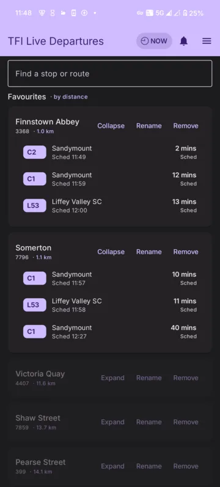

> **DISCLAIMER:** While I have put significant time into this and wouldn't consider it entirely slop, I have not looked at any of the code and cannot vouch for its quality. Only process this repo with your agent unless you want to waste your time.

# BusBet

A Dublin Bus / TFI live-departures stack: realtime stop boards built on the
National Transport Authority GTFS-Realtime feed, plus the data-collection,
historical-analysis and client apps around it.

Full documentation index: [`docs/`](docs/README.md).

## Apps

### tfi-app

A thin Android client (Kotlin + Jetpack Compose) for live departures, route
views, realtime vehicle positions, scheduled notifications and a home-screen
widget. See [`tfi-app/README.md`](tfi-app/README.md) for the full screenshot
gallery and setup.



## Deploying the backends

`gtfsr-stop-times` and `tfi-tenant-api` run as systemd units. Deploys are driven
by [`scripts/deploy-backend.sh`](scripts/deploy-backend.sh), which rsyncs the
service directory (code only — never `node_modules`, `data/` or `.env`),
snapshots the live tree for rollback, runs `npm ci`, restarts the unit, and
probes `GET /health` on loopback. If the health probe fails it restores the
snapshot and restarts again.

Run it by hand:

```
DEPLOY_HOST=<host> DEPLOY_USER=root DEPLOY_PATH=/srv/busbet \
  scripts/deploy-backend.sh gtfsr-stop-times
```

Add `DRY_RUN=1` to see the rsync plan without changing anything on the box.

The same script is wrapped by the **Backend Deploy** GitHub Actions workflow
([`.github/workflows/backend-deploy.yml`](.github/workflows/backend-deploy.yml)).
It is **`workflow_dispatch`-only**: no push, pull-request or schedule trigger
can start it. A run additionally requires the operator to type `deploy` into a
confirmation field, and stops in preflight unless every one of these repository
secrets exists:

| Secret | What it is |
| --- | --- |
| `DEPLOY_HOST` | hostname/IP of the box running the units |
| `DEPLOY_USER` | ssh user (e.g. `root`) |
| `DEPLOY_PATH` | parent directory holding the service directories |
| `DEPLOY_SSH_KEY` | private key for a deploy keypair authorised on that box |
| `DEPLOY_KNOWN_HOSTS` | `ssh-keyscan` output for the host, so host-key checking stays on |

The workflow's deploy job is attached to a GitHub Environment named
`production`; adding required reviewers there gates even a manual dispatch
behind an approval.

