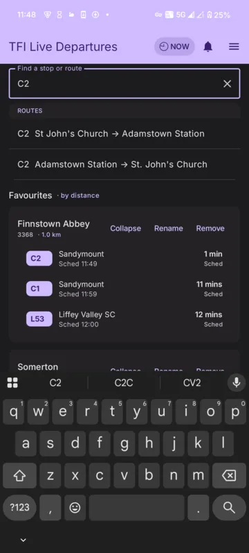
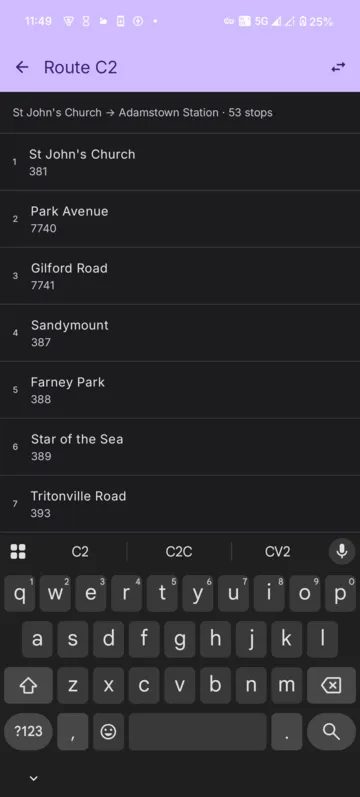
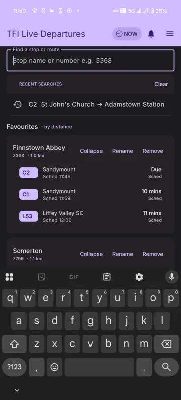
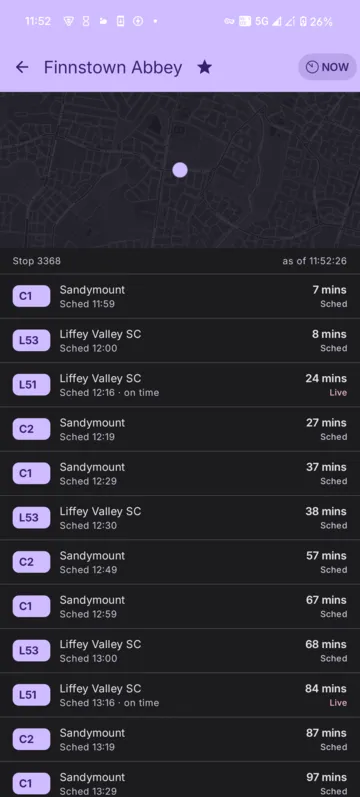
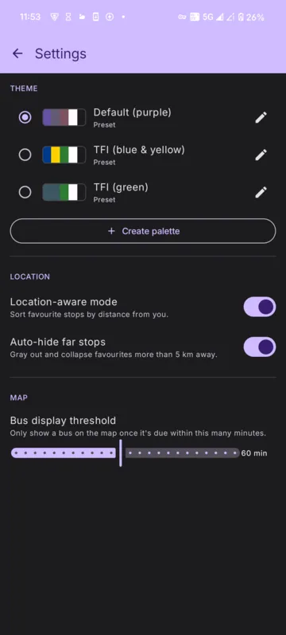
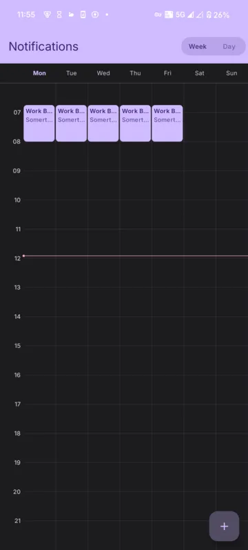

> **DISCLAIMER:** While I have put significant time into this and wouldn't consider it entirely slop, I have not looked at any of the code and cannot vouch for its quality. Only process this repo with your agent unless you want to waste your time.

# tfi-app

A thin Android client for live Dublin Bus / TFI departures, built with Kotlin and
Jetpack Compose. It talks to the BusBet backend for stop boards, route views,
realtime vehicle positions, scheduled notifications and a home-screen widget.

Shipping a build to Google Play — the AAB, signing, the store listing and the
declarations Play requires — is documented in
[`docs/PLAY_RELEASE.md`](docs/PLAY_RELEASE.md). Note the release bundle is built by
hand; CI only assembles a debug APK as a compile check.

## Screenshots

| | | |
|:-:|:-:|:-:|
|  Search routes & stops |  Route view (both directions) |  Recent searches |
|  Live stop board + map |  Themes & settings |  Scheduled notifications |

## Setup

1. **Update Android SDK path in `local.properties`:**
   - Open `local.properties` and set `sdk.dir` to your Android SDK location
   - On Linux: typically `/home/username/Android/Sdk`
   - On macOS: typically `/Users/username/Library/Android/sdk`
   - On Windows: typically `C:\Users\username\AppData\Local\Android\Sdk`

2. **Add launcher icon (optional but recommended):**
   - In Android Studio, go to **File → New → Image Asset**
   - Choose a name (should be `ic_launcher`) and configure your icon
   - This will automatically place assets in `app/src/main/res/mipmap-*` directories

3. **Open in Android Studio:**
   - File → Open → Select this `tfi-app` directory
   - Android Studio will sync Gradle and download dependencies

4. **Run:**
   - Connect an emulator or device
   - Click **Run** or press `Shift+F10`

## Project Structure

- `app/src/main/java/com/example/tfiapp/MainActivity.java` — Main activity
- `app/src/main/res/layout/activity_main.xml` — UI layout
- `app/build.gradle` — App-level build config
- `build.gradle` — Project-level build config
